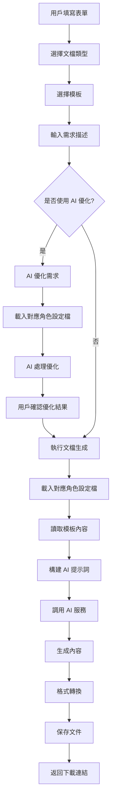
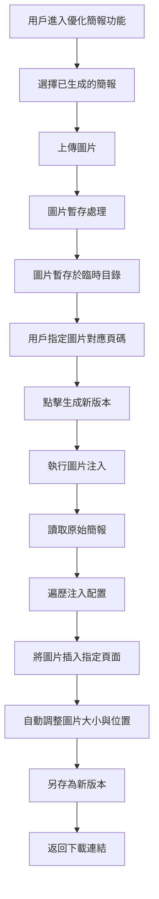
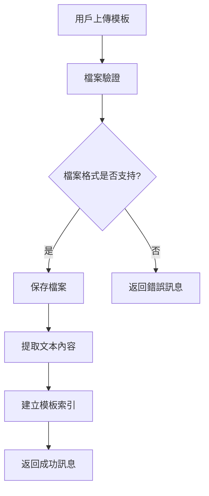
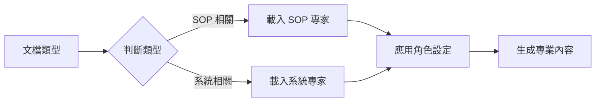
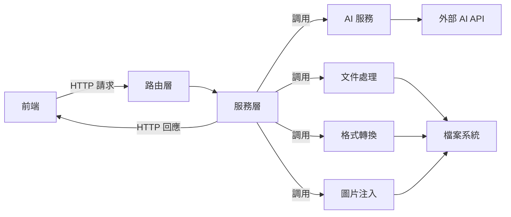

# AI 文檔生成器 V3.0 - 系統架構文檔

## 📋 目錄

1. [專案概述](#專案概述)
2. [核心功能](#核心功能)
3. [系統架構](#系統架構)
4. [業務流程](#業務流程)
5. [AI 角色設定檔系統](#ai-角色設定檔系統)
6. [模組組織](#模組組織)

---

## 專案概述

**AI 文檔生成器 V3.0** 是一個 Web 應用程式,利用 AI 根據用戶提供的模板和需求自動生成專業文檔。

### 主要特色

- 🤖 **AI 角色設定檔系統**:根據文檔類型自動載入專業角色設定
- 📊 **多格式輸出**:支持 DOCX、PPTX、PDF、Markdown
- 🔄 **SOP 全流程優化**:
    - **內容優化**:AI 智能重組與精簡內容
    - **圖片注入**:後處理方式將圖片精確插入指定頁面
- 💰 **成本追蹤**:自動記錄所有 AI 請求的使用量和成本
- 🎨 **現代化 UI**:專業的設計與動畫效果,支持多主題切換
- 🔒 **安全管理**:密碼保護的 API 設定頁面

---

## 核心功能

### 1. 文檔生成

- **支持類型**:
  - 系統文檔 (System Documentation)
  - SOP 標準作業程序 (Standard Operating Procedure)
  - 技術報告 (Technical Report)
  - SOP 優化 (SOP Optimization)

- **輸出格式**:
  - Word (`.docx`)
  - PowerPoint (`.pptx`)
  - PDF (`.pdf`)
  - Markdown (`.md`)

### 2. AI 需求優化

- 用戶可觸發 AI 優化需求描述功能
- AI 根據文檔類型和對應的角色設定檔優化需求
- 優化結果可編輯、確認使用或放棄

### 3. SOP 圖片注入

- **獨立的工作流**:位於「優化簡報」功能區
- **後處理機制**:針對已生成的純文字簡報進行圖片補充
- **精確控制**:用戶可上傳圖片並指定插入的投影片頁碼
- **自動排版**:圖片自動縮放並放置於投影片右側區域

### 4. 模板管理

- 上傳模板文件 (PDF, DOCX, PPTX, TXT)
- 自動提取文本內容
- 支持中文檔名
- 查看、刪除已上傳模板

### 5. 文檔記錄

- 查看所有生成的文檔
- **文檔篩選**:支持按「全部」、「生成文檔」、「優化簡報」篩選
- 批量選擇與刪除
- 下載已生成文檔

### 6. AI 模型設定

- 選擇 AI 引擎:Gemini / OpenAI / Mock
- 配置模型參數
- 密碼保護的設定頁面
- UI 主題切換

---

## 系統架構

### 整體架構

系統採用前後端分離的 Web 架構:

```
┌─────────────────────────────────────────┐
│           前端介面層                      │
│  (HTML + CSS + JavaScript)              │
│  - 使用者互動                            │
│  - 表單驗證                              │
│  - 狀態管理                              │
└─────────────┬───────────────────────────┘
              │ HTTP/REST API
┌─────────────▼───────────────────────────┐
│           後端服務層                      │
│  - API 路由                              │
│  - 業務邏輯                              │
│  - 權限控制                              │
└─────────────┬───────────────────────────┘
              │
    ┌─────────┼─────────┬─────────┐
    │         │         │         │
┌───▼───┐ ┌──▼──┐ ┌────▼────┐ ┌─▼──┐
│AI服務 │ │文件 │ │格式轉換 │ │圖片│
│       │ │處理 │ │         │ │注入│
└───────┘ └─────┘ └─────────┘ └────┘
```

### 後端架構

```
應用程式
├── 初始化層          # 應用程式啟動與配置
├── 路由層            # API 端點定義與請求處理
├── 服務層            # 核心業務邏輯
│   ├── AI 服務       # AI API 調用管理
│   ├── 文件處理      # 文件內容提取
│   ├── 格式轉換      # 多格式輸出轉換
│   └── 圖片注入      # PPTX 圖片後處理
└── 工具層            # 輔助函數與共用工具
```

### 前端架構

```
使用者介面
├── 主界面            # 整合所有功能的單頁應用
├── 樣式模組
│   ├── 基礎樣式      # 全域樣式定義
│   ├── 組件樣式      # 可重用組件樣式
│   └── 動畫定義      # 互動動畫效果
└── 功能模組
    ├── API 通訊      # 後端通訊與配置
    ├── UI 互動       # 介面交互邏輯
    ├── 配置管理      # 模型設定管理
    ├── 模板管理      # 模板上傳與管理
    ├── 文檔管理      # 文檔記錄管理
    ├── 生成邏輯      # 文檔生成核心
    └── 優化邏輯      # SOP 圖片注入
```

---

## 業務流程

### 1. 標準文檔生成流程



### 2. SOP 圖片注入流程



### 3. 模板管理流程



---

## AI 角色設定檔系統

### 設計理念

系統採用「角色設定檔」機制,根據不同的文檔類型自動載入對應的 AI 專家角色,確保生成內容的專業性和針對性。

### Profile 文件

#### 1. SOP 簡報優化專家

**適用範圍**:
- SOP 標準作業程序
- SOP 優化

**核心能力**:
- 簡報結構優化
- 視覺層次設計
- 內容精簡與重組

#### 2. ERP 系統文檔生成專家

**適用範圍**:
- 系統文檔
- 技術報告

**核心能力**:
- 系統架構文檔化
- 技術規格撰寫
- API 文檔生成

### 角色切換機制



---

## SOP 優化策略

### 雙軌處理機制

為了達到最佳效果,系統採用「內容生成」與「圖片整合」分離的策略:

#### 第一階段:內容生成 (AI 處理)

- 使用 SOP 專家角色設定檔指導 AI
- 專注於將凌亂的 SOP 文本重組為結構化的簡報大綱
- 生成純文字的簡報,確保版面整潔

#### 第二階段:圖片注入 (後處理)

- 使用「優化簡報」功能
- 用戶手動上傳關鍵圖片並指定頁碼
- 系統自動將圖片插入到投影片的右側區域 (佔比約 45%)
- 確保圖片不會遮擋左側的文字內容

### 優勢分析

這種方式解決了 AI 難以精確控制圖片位置的問題,同時保留了 AI 在內容整理上的優勢:

- ✅ AI 專注於內容重組,發揮其優勢
- ✅ 圖片位置精確可控,避免版面混亂
- ✅ 用戶可靈活決定哪些頁面需要配圖
- ✅ 支持多次迭代優化

---

## 模組組織

### 目錄結構

```
專案根目錄/
├── 應用程式/
│   ├── 服務層/
│   │   ├── AI 服務模組
│   │   ├── 文件處理模組
│   │   ├── 格式轉換模組
│   │   └── 圖片注入模組
│   ├── 工具層/
│   │   └── 輔助函數模組
│   └── 路由模組
├── 模板/
│   └── 主界面
├── 靜態資源/
│   ├── JavaScript 模組/
│   │   ├── API 通訊
│   │   ├── UI 互動
│   │   ├── 配置管理
│   │   ├── 模板管理
│   │   ├── 文檔管理
│   │   ├── 生成邏輯
│   │   └── 優化邏輯
│   └── CSS 樣式/
│       ├── 基礎樣式
│       ├── 組件樣式
│       └── 動畫定義
├── 輸出目錄/
│   └── 臨時圖片存儲/
├── AI 角色設定檔/
│   ├── SOP 專家角色
│   └── 系統專家角色
└── 啟動腳本
```

### 功能模組劃分

#### 前端模組

| 模組名稱 | 職責 |
|---------|------|
| API 通訊 | 處理所有與後端的通訊,統一管理 API 端點 |
| UI 互動 | 管理使用者介面的互動邏輯與頁籤切換 |
| 配置管理 | 處理 AI 模型配置的讀取與保存 |
| 模板管理 | 處理模板的上傳、列表顯示與刪除 |
| 文檔管理 | 處理生成文檔的列表、篩選與下載 |
| 生成邏輯 | 核心文檔生成流程控制 |
| 優化邏輯 | SOP 圖片注入功能控制 |

#### 後端模組

| 模組名稱 | 職責 |
|---------|------|
| 路由模組 | 定義 API 端點,處理 HTTP 請求 |
| AI 服務 | 封裝 AI API 調用,支持多種 AI 引擎 |
| 文件處理 | 提取各種格式文件的文本內容 |
| 格式轉換 | 將 Markdown 轉換為 DOCX/PPTX/PDF |
| 圖片注入 | 將圖片插入到 PPTX 的指定位置 |
| 輔助工具 | 提供檔名處理、成本記錄等共用功能 |

---

## API 介面設計

### 主要端點

| 端點 | 功能 | 說明 |
|------|------|------|
| 首頁 | 渲染主界面 | 提供使用者介面 |
| API 配置 | 讀取/保存配置 | 管理 AI 模型設定 |
| 生成文檔 | 執行文檔生成 | 根據需求生成文檔 |
| 模板列表 | 獲取模板 | 返回所有已上傳模板 |
| 生成記錄 | 獲取歷史 | 返回所有生成的文檔 |
| 圖片暫存 | 上傳圖片 | 暫存圖片用於後續注入 |
| 圖片注入 | 執行注入 | 將圖片插入簡報指定頁面 |

### 資料流向



---

## 成本追蹤機制

### 追蹤範圍

系統自動記錄所有 AI 請求的使用情況:

- **需求優化**:優化需求描述時的 AI 調用
- **文檔生成**:生成文檔內容時的 AI 調用

### 記錄內容

每次 AI 調用都會記錄:
- 時間戳記
- AI 引擎類型
- 使用的模型
- 輸入 Token 數量
- 輸出 Token 數量
- 預估成本

### 資料用途

- 成本分析與預算控制
- 使用量統計
- 效能優化參考

---

## 總結

AI 文檔生成器 V3.0 採用模組化、分層的架構設計,將複雜的文檔生成流程分解為清晰的功能模組。透過 AI 角色設定檔系統和雙軌處理機制,系統能夠生成高品質的專業文檔,同時保持靈活性和可擴展性。
