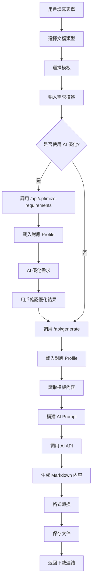
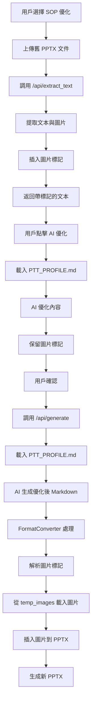

# AI 文檔生成器 V3.0 - 專案邏輯文檔

## 📋 目錄

1. [專案概述](#專案概述)
2. [核心功能](#核心功能)
3. [技術架構](#技術架構)
4. [資料流程](#資料流程)
5. [API 端點](#api-端點)
6. [AI 角色設定檔系統](#ai-角色設定檔系統)
7. [成本追蹤系統](#成本追蹤系統)
8. [SOP 優化流程](#sop-優化流程)
9. [目錄結構](#目錄結構)
10. [配置管理](#配置管理)

---

## 專案概述

**AI 文檔生成器 V3.0** 是一個基於 Flask 的 Web 應用程式，利用 AI（Google Gemini 或 OpenAI GPT）根據用戶提供的模板和需求自動生成專業文檔。

### 主要特色

- 🤖 **AI 角色設定檔系統**：根據文檔類型自動載入專業角色設定（`PTT_PROFILE.md` / `SYS_PROFILE.md`）
- 📊 **多格式輸出**：支持 DOCX、PPTX、PDF、Markdown
- 🔄 **SOP 優化**：專門針對 PowerPoint SOP 文件的風格統一與優化
- 💰 **成本追蹤**：自動記錄所有 AI 請求的 token 使用量和成本
- 🎨 **現代化 UI**：專業的漸層設計與動畫效果
- 🔒 **安全管理**：密碼保護的 API 設定頁面

---

## 核心功能

### 1. 文檔生成

- **支持類型**：
  - 系統文檔（System Documentation）
  - SOP 標準作業程序（Standard Operating Procedure）
  - 技術報告（Technical Report）
  - SOP 優化（SOP Optimization）

- **輸出格式**：
  - Word (`.docx`)
  - PowerPoint (`.pptx`)
  - PDF (`.pdf`)
  - Markdown (`.md`)

### 2. AI 需求優化

- 用戶可點擊「✨ AI 優化需求」按鈕
- AI 會根據文檔類型和對應的 Profile 優化需求描述
- 優化結果可編輯、確認使用或放棄

### 3. 模板管理

- 上傳模板文件（PDF, DOCX, PPTX, TXT）
- 自動提取文本內容
- 支持中文檔名（使用 `safe_filename` 處理）
- 查看、刪除已上傳模板

### 4. 文檔記錄

- 查看所有生成的文檔
- 批量選擇與刪除
- 下載已生成文檔

### 5. AI 模型設定

- 選擇 AI 引擎：Gemini / OpenAI / Mock
- 配置 OpenAI 模型（gpt-4o, gpt-4o-mini 等）
- 密碼保護的設定頁面

---

## 技術架構

### 後端架構

```
app/
├── __init__.py          # Flask 應用初始化
├── routes.py            # API 路由與業務邏輯
├── services/            # 服務層
│   ├── ai_service.py    # AI API 調用（Gemini/OpenAI）
│   ├── file_processor.py  # 文件處理（提取文本）
│   └── format_converter.py  # 格式轉換（Markdown → DOCX/PPTX/PDF）
└── utils/               # 工具函數
    └── helpers.py       # 輔助函數（safe_filename, log_cost_to_file）
```

### 前端架構

- **框架**：原生 HTML + CSS + JavaScript
- **設計風格**：現代化漸層設計、Glassmorphism
- **字體**：Inter (Google Fonts)
- **動畫**：CSS Keyframes（fadeIn, fadeInUp, slideInDown）

---

## 資料流程

### 1. 標準文檔生成流程



### 2. SOP 優化流程



---

## API 端點

### 主要端點

| 端點 | 方法 | 功能 | 說明 |
|------|------|------|------|
| `/` | GET | 首頁 | 渲染主界面 |
| `/api/config` | GET/POST | API 配置 | 讀取/保存 AI 模型配置 |
| `/api/verify-password` | POST | 密碼驗證 | 驗證管理員密碼 |
| `/api/optimize-requirements` | POST | AI 優化需求 | 使用 AI 優化用戶需求描述 |
| `/api/generate` | POST | 生成文檔 | 根據需求生成文檔 |
| `/api/upload_template` | POST | 上傳模板 | 上傳並保存模板文件 |
| `/api/templates` | GET | 獲取模板列表 | 返回所有已上傳模板 |
| `/api/template_content/<filename>` | GET | 查看模板內容 | 返回模板文本內容 |
| `/api/delete_template/<filename>` | DELETE | 刪除模板 | 刪除指定模板 |
| `/api/generated_documents` | GET | 獲取生成記錄 | 返回所有生成的文檔 |
| `/api/download/<filename>` | GET | 下載文檔 | 下載指定文檔 |
| `/api/delete_document/<filename>` | DELETE | 刪除文檔 | 刪除指定生成文檔 |
| `/api/batch_delete_generated` | POST | 批量刪除 | 批量刪除生成的文檔 |
| `/api/extract_text` | POST | 提取文本 | 從 PPTX 提取文本和圖片 |

### 端點詳細說明

#### `/api/optimize-requirements` (POST)

**功能**：使用 AI 優化用戶的需求描述

**請求參數**：
```json
{
  "requirements": "原始需求描述",
  "doc_type": "sop|system_doc|technical_report|sop_optimize"
}
```

**處理流程**：
1. 根據 `doc_type` 選擇 Profile：
   - `sop` 或 `sop_optimize` → `PTT_PROFILE.md`
   - 其他 → `SYS_PROFILE.md`
2. 讀取 Profile 內容
3. 構建優化提示詞（Profile + 具體指令）
4. 調用 AI API
5. 記錄 token 使用量到 `logs/cost_log.csv`

**返回**：
```json
{
  "success": true,
  "optimized_requirements": "優化後的需求",
  "original_requirements": "原始需求"
}
```

#### `/api/generate` (POST)

**功能**：生成文檔

**請求參數**：
```json
{
  "doc_type": "文檔類型",
  "template": "模板檔名",
  "requirements": "需求描述",
  "output_format": "docx|pptx|pdf|md",
  "image_folder": "圖片資料夾名稱（SOP 優化用）"
}
```

**處理流程**：
1. 讀取模板內容
2. 根據 `doc_type` 載入對應 Profile
3. 構建 AI Prompt（Profile + 模板 + 需求）
4. 調用 AI API 生成 Markdown
5. 使用 `FormatConverter` 轉換格式
6. 保存文件到 `output/`
7. 記錄 token 使用量

**返回**：
```json
{
  "success": true,
  "filename": "generated_xxx.docx",
  "download_url": "/api/download/generated_xxx.docx"
}
```

#### `/api/extract_text` (POST)

**功能**：從 PPTX 提取文本和圖片（用於 SOP 優化）

**請求參數**：
- `file`: PPTX 文件（multipart/form-data）

**處理流程**：
1. 保存上傳的 PPTX 到 `uploads/`
2. 使用 `python-pptx` 遍歷每張投影片
3. 提取文本內容
4. 提取圖片並保存到 `output/temp_images/<folder_name>/`
5. 在文本中插入圖片標記：`[圖片 X-Y: 來自投影片 Z]`

**返回**：
```json
{
  "success": true,
  "text": "帶圖片標記的文本內容",
  "image_folder": "資料夾名稱"
}
```

---

## AI 角色設定檔系統

### 概述

為了讓 AI 生成更專業、更符合特定領域需求的文檔，系統引入了**角色設定檔（Profile）**機制。

### Profile 文件

#### 1. `PTT_PROFILE.md` - SOP 簡報優化專家

**適用範圍**：
- 文檔類型為 `sop`（SOP 標準作業程序）
- 文檔類型為 `sop_optimize`（SOP 優化）

**角色定義**：
- 專業 SOP 簡報優化專家
- 熟悉企業內部 ERP 系統操作流程
- 擅長將複雜流程轉化為清晰的視覺化簡報

**核心技能**：
- 簡報結構優化
- 視覺層次設計
- 內容精簡與重組
- 圖片標記保留

#### 2. `SYS_PROFILE.md` - ERP 系統文檔生成專家

**適用範圍**：
- 文檔類型為 `system_doc`（系統文檔）
- 文檔類型為 `technical_report`（技術報告）

**角色定義**：
- 資深 ERP 系統分析師
- 熟悉系統架構設計與技術文檔撰寫
- 擅長將技術細節轉化為清晰的文檔

**核心技能**：
- 系統架構文檔化
- 技術規格撰寫
- API 文檔生成
- 資料庫設計文檔

### Profile 載入邏輯

```python
# 在 app/routes.py 中
def load_profile(doc_type):
    profile_content = ""
    
    # 根據文檔類型選擇 Profile
    if doc_type in ['sop', 'sop_optimize']:
        profile_path = 'PTT_PROFILE.md'
    else:
        profile_path = 'SYS_PROFILE.md'
    
    # 讀取 Profile 內容
    if os.path.exists(profile_path):
        with open(profile_path, 'r', encoding='utf-8') as f:
            profile_content = f.read()
        profile_content = f"{profile_content}\n\n=== Role Definition End ===\n\n"
    
    return profile_content
```

### Profile 注入位置

Profile 內容會被注入到 AI Prompt 的**最前方**：

```
{Profile 內容}

=== Role Definition End ===

{具體任務指令}

模板內容：
{template_content}

用戶需求：
{user_requirements}

...
```

這確保 AI 在處理任務時，首先理解並扮演指定的專業角色。

---

## 成本追蹤系統

### 概述

系統會自動追蹤所有 AI API 調用的 token 使用量和成本，並記錄到 `logs/cost_log.csv`。

### 記錄內容

| 欄位 | 說明 |
|------|------|
| `timestamp` | 調用時間（ISO 8601 格式）|
| `model` | 使用的模型名稱 |
| `input_tokens` | 輸入 token 數量 |
| `output_tokens` | 輸出 token 數量 |
| `cost_usd` | 成本（美元）|

### 實現邏輯

#### 1. Gemini API

```python
# app/services/ai_service.py
def call_gemini_api(self, prompt):
    # ... 調用 API
    response = chat_session.send_message(prompt)
    
    # 提取 token 使用量
    input_tokens = 0
    output_tokens = 0
    
    if hasattr(response, 'usage_metadata'):
        usage_metadata = response.usage_metadata
        input_tokens = getattr(usage_metadata, 'prompt_token_count', 0)
        output_tokens = getattr(usage_metadata, 'candidates_token_count', 0)
    
    # Gemini 2.0 Flash 免費
    cost = 0.0
    
    # 記錄到 CSV
    log_cost_to_file(model_name, input_tokens, output_tokens, cost)
```

#### 2. OpenAI API

```python
def call_openai_api(self, prompt):
    # ... 調用 API
    result = response.json()
    
    # 提取 token 使用量
    usage = result.get('usage', {})
    input_tokens = usage.get('prompt_tokens', 0)
    output_tokens = usage.get('completion_tokens', 0)
    
    # 計算成本
    pricing = self.config['OPENAI_PRICING'].get(model, {'input': 0, 'output': 0})
    cost = (input_tokens / 1000000 * pricing['input']) + \
           (output_tokens / 1000000 * pricing['output'])
    
    # 記錄到 CSV
    log_cost_to_file(model, input_tokens, output_tokens, cost)
```

### 成本計算

OpenAI 定價（在 `app/__init__.py` 中定義）：

```python
OPENAI_PRICING = {
    'gpt-4o': {'input': 2.50, 'output': 10.00},
    'gpt-4o-mini': {'input': 0.150, 'output': 0.600},
    'gpt-4-turbo': {'input': 10.00, 'output': 30.00},
    'gpt-4': {'input': 30.00, 'output': 60.00},
    'gpt-3.5-turbo': {'input': 0.50, 'output': 1.50}
}
```

單位：美元 / 百萬 tokens

### 查看成本

用戶可以通過以下方式查看成本：

```python
import pandas as pd

df = pd.read_csv('logs/cost_log.csv')
total_usd = df['cost_usd'].sum()
total_twd = total_usd * 32.5  # 假設匯率 32.5

print(f"Total USD: {total_usd}")
print(f"Total TWD: {total_twd}")
```

---

## SOP 優化流程

### 問題背景

舊的 SOP 文件（通常是 PowerPoint 格式）存在以下問題：
- 格式不統一
- 內容冗長
- 圖片位置混亂
- 缺乏標準化結構

### 解決方案

#### 1. 圖片標記系統

**目的**：在文本提取過程中保留圖片位置信息

**實現**：
```python
# app/services/file_processor.py
def extract_text_from_pptx(file_path):
    # ...
    for slide_num, slide in enumerate(prs.slides, 1):
        # 提取文本
        for shape in slide.shapes:
            if hasattr(shape, "text"):
                slide_text += shape.text + "\n"
        
        # 提取圖片
        for shape in slide.shapes:
            if shape.shape_type == 13:  # Picture
                image = shape.image
                # 保存圖片
                image_filename = f"slide_{slide_num}_img_{img_count}.{ext}"
                # ...
                
                # 插入標記
                slide_text += f"\n[圖片 {slide_num}-{img_count}: 來自投影片 {slide_num}]\n"
```

**標記格式**：`[圖片 X-Y: 來自投影片 Z]`
- `X`：投影片編號
- `Y`：圖片編號
- `Z`：來源投影片

#### 2. AI 優化指令

在 `PTT_PROFILE.md` 中明確要求：

```markdown
**圖片標記處理**：
- 所有 [圖片 X-Y: 來自投影片 Z] 標記必須保留
- 圖片標記應放在相關內容的適當位置
- 不要刪除任何圖片標記
```

#### 3. 圖片還原

```python
# app/services/format_converter.py
def markdown_to_pptx(self, md_content, output_path, image_folder=None):
    # ...
    # 解析圖片標記
    image_pattern = r'\[圖片 (\d+)-(\d+): 來自投影片 (\d+)\]'
    
    for match in re.finditer(image_pattern, slide_content):
        slide_num = match.group(1)
        img_num = match.group(2)
        
        # 構建圖片路徑
        image_filename = f"slide_{slide_num}_img_{img_num}.*"
        image_path = find_image(image_folder, image_filename)
        
        if image_path and os.path.exists(image_path):
            # 插入圖片到投影片
            slide.shapes.add_picture(image_path, left, top, width, height)
```

### 完整流程示例

1. **用戶上傳** `old_sop.pptx`（14 頁）
2. **系統提取**：
   ```
   # 投影片 1
   系統登入流程
   [圖片 1-1: 來自投影片 1]
   
   # 投影片 2
   主選單操作
   [圖片 2-1: 來自投影片 2]
   [圖片 2-2: 來自投影片 2]
   ...
   ```
3. **AI 優化**（載入 `PTT_PROFILE.md`）：
   - 重組內容結構
   - 精簡文字
   - **保留所有圖片標記**
4. **生成新 PPTX**：
   - 解析 Markdown
   - 還原圖片到對應位置
   - 輸出優化後的 `generated_sop_optimize_xxx.pptx`

---

## 目錄結構

```
doc_generator_v3/
├── app/
│   ├── __init__.py                 # Flask 應用初始化
│   ├── routes.py                   # API 路由
│   ├── services/
│   │   ├── __init__.py
│   │   ├── ai_service.py           # AI API 調用
│   │   ├── file_processor.py       # 文件處理
│   │   └── format_converter.py     # 格式轉換
│   └── utils/
│       ├── __init__.py
│       └── helpers.py               # 輔助函數
├── templates/
│   └── index_v3.html               # 前端界面
├── static/
│   └── icon.png                    # 應用圖標
├── config/
│   └── api_config.json             # API 配置（可選）
├── logs/
│   └── cost_log.csv                # 成本記錄
├── output/                         # 生成的文檔
│   └── temp_images/                # 臨時圖片資料夾
├── uploads/                        # 上傳的臨時文件
├── templates_storage/              # 模板存儲
├── PTT_PROFILE.md                  # SOP 專家角色設定
├── SYS_PROFILE.md                  # 系統文檔專家角色設定
├── .env                            # 環境變數（API Keys）
├── .env.example                    # 環境變數範例
├── requirements.txt                # Python 依賴
├── run.py                          # 應用入口
├── PROJECT_LOGIC.md                # 本文檔
├── README.md                       # 專案說明
└── ISSUE.md                        # 已知問題
```

---

## 配置管理

### 環境變數（`.env`）

```env
# Google Gemini API
GEMINI_API_KEY=your_gemini_api_key_here

# OpenAI API
OPENAI_API_KEY=your_openai_api_key_here

# API 類型（gemini/openai/mock）
API_TYPE=gemini

# OpenAI 模型
OPENAI_MODEL=gpt-4o-mini

# 管理員密碼
ADMIN_PASSWORD=your_secure_password
```

### API 配置（`config/api_config.json`）

```json
{
  "api_type": "gemini",
  "gemini_api_key": "...",
  "openai_api_key": "...",
  "openai_model": "gpt-4o-mini",
  "gemini_model": "gemini-2.0-flash-exp"
}
```

**優先級**：環境變數 > JSON 配置文件

### Flask 配置（`app/__init__.py`）

```python
app.config['SECRET_KEY'] = os.environ.get('SECRET_KEY', 'dev-secret-key')
app.config['UPLOAD_FOLDER'] = 'uploads'
app.config['TEMPLATE_STORAGE'] = 'templates_storage'
app.config['OUTPUT_FOLDER'] = 'output'
app.config['MAX_CONTENT_LENGTH'] = 50 * 1024 * 1024  # 50MB
app.config['ADMIN_PASSWORD'] = os.environ.get('ADMIN_PASSWORD', 'sunon')
```

---

## 安全機制

### 1. 文件名安全處理

使用 `safe_filename` 函數處理中文檔名：

```python
def safe_filename(filename):
    """安全處理文件名，支持中文"""
    if not filename:
        return "unnamed_file"
    
    # 分離文件名和副檔名
    name, ext = os.path.splitext(filename)
    
    # 移除危險字符
    dangerous_chars = ['..', '/', '\\', '\x00']
    for char in dangerous_chars:
        name = name.replace(char, '_')
    
    # 保留中文、英文、數字、底線、連字號
    import re
    name = re.sub(r'[^\w\u4e00-\u9fff\-]', '_', name)
    
    return name + ext
```

### 2. 密碼保護

API 設定頁面需要密碼驗證：

```javascript
// 前端
const password = prompt("請輸入管理員密碼：");
const response = await fetch('/api/verify-password', {
    method: 'POST',
    headers: { 'Content-Type': 'application/json' },
    body: JSON.stringify({ password })
});
```

### 3. 文件上傳限制

- 最大文件大小：50MB
- 允許的文件類型：PDF, DOCX, DOC, PPTX, PPT, TXT, MD

---

## 前端 UI 設計

### 設計理念

- **現代化**：使用漸層背景、Glassmorphism 效果
- **專業感**：Inter 字體、精心設計的配色
- **互動性**：Hover 效果、動畫過渡
- **響應式**：支持桌面和移動設備

### 配色方案

```css
:root {
    --primary: #6366f1;        /* Indigo */
    --primary-dark: #4f46e5;
    --secondary: #8b5cf6;      /* Purple */
    --success: #10b981;        /* Green */
    --danger: #ef4444;         /* Red */
    --warning: #f59e0b;        /* Amber */
    --dark: #1e293b;
    --light: #f8fafc;
    --border: #e2e8f0;
}
```

### 特色 UI 元素

#### 1. AI 優化結果區域

- **背景**：淺紫色漸層 (`#f5f3ff` → `#eef2ff`)
- **邊框**：Indigo 色 (`#818cf8`)
- **陰影**：柔和的 box-shadow
- **徽章**：「AI Generated」標籤
- **動畫**：`slideInDown` 滑入效果

#### 2. 格式選擇器

- **選中狀態**：漸層背景 + 放大效果
- **圖標**：Emoji 表情符號（📄 📊 📕 📝）
- **過渡**：平滑的 transform 動畫

#### 3. 上傳區域

- **拖放支持**：Drag & Drop
- **Hover 效果**：背景色變化 + 縮放
- **視覺反饋**：虛線邊框 + 漸層背景

---

## 已知問題與解決方案

詳見 `ISSUE.md`

### 主要問題

1. **SOP 優化內容縮減**
   - **現象**：14 頁 → 6 頁
   - **原因**：AI 過度總結
   - **解決**：在 `PTT_PROFILE.md` 中強調「保留所有關鍵信息」

2. **圖片插入問題**
   - **現象**：圖片無法正確插入
   - **原因**：圖片標記解析錯誤或路徑問題
   - **解決**：改進 `FormatConverter` 的圖片處理邏輯

---

## 開發與部署

### 本地開發

```bash
# 1. 創建虛擬環境
python -m venv venv
venv\Scripts\activate  # Windows
source venv/bin/activate  # Linux/Mac

# 2. 安裝依賴
pip install -r requirements.txt

# 3. 配置環境變數
cp .env.example .env
# 編輯 .env 填入 API Keys

# 4. 運行應用
python run.py
```

### 生產部署

建議使用 Gunicorn + Nginx：

```bash
# 安裝 Gunicorn
pip install gunicorn

# 運行
gunicorn -w 4 -b 0.0.0.0:5000 run:app
```

---

## 未來規劃

1. **多語言支持**：英文、日文界面
2. **協作功能**：多用戶協作編輯
3. **版本控制**：文檔版本管理
4. **模板市場**：共享和下載模板
5. **AI 微調**：針對特定領域的模型微調

---

## 總結

**AI 文檔生成器 V3.0** 是一個功能完整、設計精美的文檔自動化工具。通過 AI 角色設定檔系統、成本追蹤、SOP 優化等特色功能，為用戶提供專業、高效的文檔生成體驗。

**核心優勢**：
- ✅ 智能角色扮演（Profile 系統）
- ✅ 多格式輸出
- ✅ 成本透明化
- ✅ 中文友好
- ✅ 現代化 UI

**適用場景**：
- 企業內部文檔標準化
- SOP 流程優化
- 技術文檔生成
- 系統設計文檔

---

**文檔版本**：V3.0  
**最後更新**：2025-11-28  
**維護者**：AI 文檔生成器團隊
