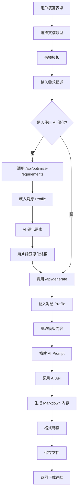
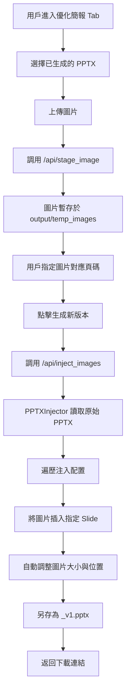

# AI 文檔生成器 V3.0 - 專案邏輯文檔

## 📋 目錄

1. [專案概述](#專案概述)
2. [核心功能](#核心功能)
3. [技術架構](#技術架構)
4. [資料流程](#資料流程)
5. [API 端點](#api-端點)
6. [AI 角色設定檔系統](#ai-角色設定檔系統)
7. [成本追蹤系統](#成本追蹤系統)
8. [SOP 優化流程](#sop-優化流程)
9. [目錄結構](#目錄結構)
10. [配置管理](#配置管理)

---

## 專案概述

**AI 文檔生成器 V3.0** 是一個基於 Flask 的 Web 應用程式，利用 AI（Google Gemini 或 OpenAI GPT）根據用戶提供的模板和需求自動生成專業文檔。

### 主要特色

- 🤖 **AI 角色設定檔系統**：根據文檔類型自動載入專業角色設定（`PTT_PROFILE.md` / `SYS_PROFILE.md`）
- 📊 **多格式輸出**：支持 DOCX、PPTX、PDF、Markdown
- 🔄 **SOP 全流程優化**：
    - **內容優化**：AI 智能重組與精簡內容
    - **圖片注入**：後處理（Post-Processing）方式將圖片精確插入指定頁面
- 💰 **成本追蹤**：自動記錄所有 AI 請求的 token 使用量和成本
- 🎨 **現代化 UI**：專業的漸層設計與動畫效果，支持多主題切換
- ❓ **即時說明**：獨立的系統架構說明頁面，支持 Markdown 渲染與目錄導航
- 🔒 **安全管理**：密碼保護的 API 設定頁面

---

## 核心功能

### 1. 文檔生成

- **支持類型**：
  - 系統文檔（System Documentation）
  - SOP 標準作業程序（Standard Operating Procedure）
  - 技術報告（Technical Report）
  - SOP 優化（SOP Optimization）

- **輸出格式**：
  - Word (`.docx`)
  - PowerPoint (`.pptx`)
  - PDF (`.pdf`)
  - Markdown (`.md`)

### 2. AI 需求優化

- 用戶可點擊「✨ AI 優化需求」按鈕
- AI 會根據文檔類型和對應的 Profile 優化需求描述
- 優化結果可編輯、確認使用或放棄

### 3. SOP 圖片注入 (新功能)

- **獨立的工作流**：位於「優化簡報」Tab
- **後處理機制**：針對已生成的純文字 PPTX 進行圖片補充
- **精確控制**：用戶可上傳圖片並指定插入的投影片頁碼
- **自動排版**：圖片自動縮放並放置於投影片右側區域

### 4. 模板管理

- 上傳模板文件（PDF, DOCX, PPTX, TXT）
- 自動提取文本內容
- 支持中文檔名（使用 `safe_filename` 處理）
- 查看、刪除已上傳模板

### 5. 文檔記錄

- 查看所有生成的文檔
- **文檔篩選**：支持按「全部」、「生成文檔」、「優化簡報」篩選
- 批量選擇與刪除
- 下載已生成文檔

### 6. AI 模型設定

- 選擇 AI 引擎：Gemini / OpenAI / Mock
- 配置 OpenAI 模型（gpt-4o, gpt-4o-mini 等）
- 密碼保護的設定頁面
- UI 主題切換

### 7. 系統說明 (新功能)

- **獨立頁面**：`/help` 路由提供完整的系統架構說明
- **動態加載**：從後端 API 獲取 Markdown 內容並前端渲染
- **目錄導航**：自動生成目錄，支持點擊跳轉
- **回到頂部**：長文檔友好的懸浮按鈕

---

## 技術架構

### 後端架構

```
app/
├── __init__.py          # Flask 應用初始化
├── routes.py            # API 路由與業務邏輯
├── services/            # 服務層
│   ├── ai_service.py    # AI API 調用（Gemini/OpenAI）
│   ├── file_processor.py  # 文件處理（提取文本）
│   ├── format_converter.py  # 格式轉換（Markdown → DOCX/PPTX/PDF）
│   └── ppt_injector.py    # PPTX 圖片注入服務 (新)
└── utils/               # 工具函數
    └── helpers.py       # 輔助函數（safe_filename, log_cost_to_file）
```

### 前端架構

#### 技術棧

- **框架**：原生 HTML + CSS + JavaScript
- **UI 庫**：DaisyUI + Tailwind CSS
- **設計風格**：現代化漸層設計、Glassmorphism
- **字體**：Inter (Google Fonts)

#### 模組化結構

**HTML 檔案**:
**HTML 檔案**:
- `templates/index_v3_daisy.html` - 主界面 (整合 DaisyUI)
- `templates/help.html` - 系統說明頁面 (獨立，使用 marked.js)

**CSS 模組** (`static/css/`):
- `main.css` - 基礎樣式
- `components.css` - 組件樣式
- `animations.css` - 動畫定義

**JavaScript 模組** (`static/js/`):
- `api.js` - API 配置和通用工具
- `ui.js` - UI 交互與 Tab 切換
- `config.js` - 模型配置管理
- `templates.js` - 模板管理
- `documents.js` - 文檔記錄管理
- `generate.js` - 文檔生成核心邏輯
- `optimize.js` - SOP 圖片注入邏輯 (新)

---

## 資料流程

### 1. 標準文檔生成流程



### 2. SOP 圖片注入流程 (Post-Processing)



---

## API 端點

### 主要端點

| 端點 | 方法 | 功能 | 說明 |
|------|------|------|------|
| `/` | GET | 首頁 | 渲染主界面 |
| `/api/config` | GET/POST | API 配置 | 讀取/保存 AI 模型配置 |
| `/api/generate` | POST | 生成文檔 | 根據需求生成文檔 |
| `/api/templates` | GET | 獲取模板列表 | 返回所有已上傳模板 |
| `/api/history` | GET | 獲取生成記錄 | 返回所有生成的文檔 |
| `/help` | GET | 說明頁面 | 渲染系統架構說明頁面 |
| `/api/help` | GET | 獲取說明內容 | 返回 PROJECT_ARCHITECTURE.md 的內容 |
| `/api/stage_image` | POST | 圖片暫存 | 上傳圖片用於後續注入 (新) |
| `/api/inject_images` | POST | 圖片注入 | 將圖片插入 PPTX 指定頁面 (新) |

### 新增端點詳細說明

#### `/api/stage_image` (POST)

**功能**：暫存上傳的圖片，返回臨時路徑

**請求參數**：
- `image`: 圖片文件 (multipart/form-data)

**返回**：
```json
{
  "success": true,
  "filename": "原始檔名",
  "path": "絕對路徑"
}
```

#### `/api/inject_images` (POST)

**功能**：將暫存的圖片注入到指定的 PPTX 頁面

**請求參數**：
```json
{
  "filename": "source.pptx",
  "injections": [
    {
      "image_path": "/path/to/image1.png",
      "slide_number": 1
    },
    {
      "image_path": "/path/to/image2.png",
      "slide_number": 3
    }
  ]
}
```

**返回**：
```json
{
  "success": true,
  "filename": "source_v1.pptx",
  "download_url": "/api/download/source_v1.pptx"
}
```

---

## AI 角色設定檔系統

### Profile 文件

#### 1. `PTT_PROFILE.md` - SOP 簡報優化專家

**適用範圍**：
- 文檔類型為 `sop`（SOP 標準作業程序）
- 文檔類型為 `sop_optimize`（SOP 優化）

**核心技能**：
- 簡報結構優化
- 視覺層次設計
- 內容精簡與重組

#### 2. `SYS_PROFILE.md` - ERP 系統文檔生成專家

**適用範圍**：
- 文檔類型為 `system_doc`（系統文檔）
- 文檔類型為 `technical_report`（技術報告）

**核心技能**：
- 系統架構文檔化
- 技術規格撰寫
- API 文檔生成

---

## SOP 優化流程

### 雙軌策略

為了達到最佳效果，系統採用「內容生成」與「圖片整合」分離的策略：

1.  **第一階段：內容生成 (AI)**
    - 使用 `PTT_PROFILE.md` 指導 AI
    - 專注於將凌亂的 SOP 文本重組為結構化的簡報大綱
    - 生成純文字的 PPTX，確保版面整潔

2.  **第二階段：圖片注入 (Post-Processing)**
    - 使用「優化簡報」Tab
    - 用戶手動上傳關鍵圖片並指定頁碼
    - 系統自動將圖片插入到 Slide 的右側區域（佔比約 45%）
    - 確保圖片不會遮擋左側的文字內容

這種方式解決了 AI 難以精確控制圖片位置的問題，同時保留了 AI 在內容整理上的優勢。

---

## 目錄結構

```
doc_generator_v3/
├── app/
│   ├── services/
│   │   ├── ppt_injector.py    # PPTX 圖片注入服務
│   │   └── ...
│   └── routes.py              # API 路由
├── templates/
│   ├── index_v3_daisy.html    # 主界面
│   └── help.html              # 說明頁面
├── static/
│   ├── js/
│   │   ├── optimize.js        # 圖片注入前端邏輯
│   │   └── ...
│   └── css/
├── output/                    # 生成結果
│   └── temp_images/           # 臨時圖片存儲
├── PTT_PROFILE.md             # SOP 專家角色
├── SYS_PROFILE.md             # 系統專家角色
├── PROJECT_LOGIC.md           # 本文檔
└── run.py                     # 啟動腳本
```
