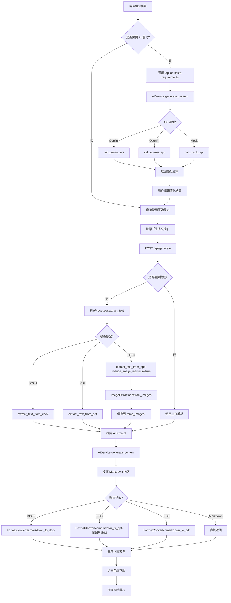

# Document Generator V3 - 專案邏輯說明

## 📋 目錄

1. [專案概述](#專案概述)
2. [系統架構](#系統架構)
3. [核心流程](#核心流程)
4. [模組說明](#模組說明)
5. [API 端點](#api-端點)
6. [資料流向](#資料流向)
7. [設計模式](#設計模式)

---

## 專案概述

### 功能定位
這是一個基於 Flask 的 **AI 驅動文檔生成系統**，支援：
- 📝 多種文檔類型生成（系統文檔、SOP、技術報告）
- 🤖 AI 需求優化（Gemini / OpenAI）
- 📤 多格式輸出（DOCX, PPTX, PDF, Markdown）
- 📋 模板管理（上傳、選擇、刪除）
- 📊 成本追蹤（OpenAI API 使用記錄）
- 🖼️ 圖片處理（從 PPTX 提取、插入到生成的簡報）

### 技術棧
```
後端框架：   Flask 3.1.0 + Flask-CORS
AI 整合：    Google Gemini API, OpenAI API
文件處理：   python-docx, python-pptx, PyMuPDF
PDF 生成：   ReportLab
圖片處理：   Pillow (PIL)
環境管理：   python-dotenv
前端：       原生 JavaScript + Bootstrap 5
```

---

## 系統架構

### 目錄結構
```
doc_generator_v3/
├── app/
│   ├── __init__.py          # Flask 應用工廠
│   ├── routes.py            # 路由與 API 端點（核心邏輯）
│   ├── services/            # 業務邏輯層
│   │   ├── ai_service.py        # AI API 調用
│   │   ├── file_service.py      # 文件讀取/提取
│   │   ├── format_service.py    # 格式轉換 (Markdown → DOCX/PPTX/PDF)
│   │   └── image_service.py     # 圖片提取與管理
│   └── utils/               # 工具函數
│       └── helpers.py           # 成本記錄
├── config/
│   ├── settings.py          # 配置類（環境變數、OpenAI 定價）
│   └── api_config.json      # API 金鑰存儲（可被環境變數覆蓋）
├── templates/
│   └── index_v3.html        # 主前端頁面（單頁應用）
├── static/                  # 靜態資源（CSS, JS, 圖示）
├── uploads/                 # 用戶上傳的模板文件
├── logs/                    # 成本記錄 CSV
├── temp_images/             # 臨時圖片文件夾
├── run.py                   # 應用入口
└── .env                     # 環境變數（不提交至 Git）
```

### 架構圖
```
┌─────────────────────────────────────────────────────────────┐
│                        使用者瀏覽器                           │
│                     (templates/index_v3.html)                │
└──────────────────────┬──────────────────────────────────────┘
                       │ HTTP Request (JSON)
                       ↓
┌─────────────────────────────────────────────────────────────┐
│                      Flask Application                       │
│                        (app/routes.py)                       │
│  ┌────────────────────────────────────────────────────────┐ │
│  │ API Routes:                                            │ │
│  │ • POST /api/generate          # 生成文檔               │ │
│  │ • POST /api/optimize-requirements # AI 優化需求        │ │
│  │ • POST /api/upload-template   # 上傳模板               │ │
│  │ • GET  /api/templates         # 獲取模板列表           │ │
│  │ • DELETE /api/delete-template # 刪除模板               │ │
│  │ • POST /api/save-api-config   # 保存 API 配置          │ │
│  │ • GET  /api/get-api-config    # 獲取 API 配置          │ │
│  └────────────────────────────────────────────────────────┘ │
└──────────┬──────────────┬──────────────┬────────────────────┘
           │              │              │
           ↓              ↓              ↓
┌──────────────┐  ┌──────────────┐  ┌──────────────┐
│ AIService    │  │ FileProcessor│  │FormatConverter│
│              │  │              │  │              │
│ • Gemini     │  │ • PDF        │  │ • Markdown   │
│ • OpenAI     │  │ • DOCX       │  │   → DOCX     │
│ • Mock       │  │ • PPTX       │  │   → PPTX     │
│ • 成本追蹤   │  │ • TXT/MD     │  │   → PDF      │
└──────────────┘  └──────────────┘  └──────────────┘
```

---

## 核心流程

### 流程 1：文檔生成 (完整流程)



#### 詳細步驟說明

**步驟 1-3：需求優化（可選）**
```python
# 用戶點擊「✨ AI 優化需求」
POST /api/optimize-requirements
{
    "requirements": "開發一個電商網站",
    "doc_type": "system_doc"
}

# 後端處理
1. 根據 doc_type 構建專業提示詞
2. 調用 AIService.generate_content()
3. 返回優化結果供用戶編輯
```

**步驟 4-6：生成文檔**
```python
# 用戶點擊「生成文檔」
POST /api/generate
{
    "requirements": "優化後的需求描述",
    "doc_type": "system_doc",
    "template": "my_template.pptx",  # 可選
    "output_format": "pptx"
}

# 後端處理
1. 如果有模板，提取模板內容和圖片
2. 構建完整的 AI Prompt（模板內容 + 需求）
3. 調用 AI 生成 Markdown 內容
4. 轉換為指定格式（DOCX/PPTX/PDF）
5. 如果是 PPTX，將圖片插入對應位置
6. 返回下載文件
```

---

### 流程 2：AI 需求優化

```
┌─────────────┐
│ 用戶輸入需求 │
└──────┬──────┘
       │
       ↓
┌──────────────────────────────────┐
│ 前端 JavaScript                   │
│ • 檢查需求是否為空                 │
│ • 檢查是否選擇文檔類型              │
│ • 顯示載入狀態                     │
└──────┬───────────────────────────┘
       │ POST /api/optimize-requirements
       ↓
┌──────────────────────────────────┐
│ 後端 routes.py                    │
│ 1. 接收 requirements, doc_type    │
│ 2. 構建優化提示詞                  │
│ 3. 呼叫 AIService.call_ai_api()   │
└──────┬───────────────────────────┘
       │
       ↓
┌──────────────────────────────────┐
│ AIService.generate_content()      │
│ • 重新加載配置（環境變數優先）      │
│ • 根據 api_type 路由              │
└──────┬───────────────────────────┘
       │
       ├─ api_type = 'gemini'  ──→ call_gemini_api()
       │                            • 使用 gemini-2.0-flash-exp
       │                            • 3 次重試機制
       │                            • 返回內容 + 使用資訊
       │
       ├─ api_type = 'openai'  ──→ call_openai_api()
       │                            • 使用指定模型（預設 gpt-4o-mini）
       │                            • 計算 Token 成本
       │                            • 記錄到 logs/cost_log.csv
       │
       └─ api_type = 'mock'    ──→ call_mock_api()
                                   • 返回模擬內容（測試用）
       │
       ↓
┌──────────────────────────────────┐
│ 前端接收優化結果                   │
│ • 顯示優化區域                     │
│ • 填入優化後的需求（可編輯）        │
│ • 提供三個按鈕：                   │
│   ✅ 使用優化後的需求               │
│   ↩️ 恢復原始需求                  │
│   ❌ 取消                          │
└──────────────────────────────────┘
```

---

### 流程 3：模板管理

```
上傳模板：
用戶選擇文件 → POST /api/upload-template → 檢查文件格式 → 保存到 uploads/

獲取模板列表：
GET /api/templates → 掃描 uploads/ 目錄 → 返回 JSON 列表

刪除模板：
用戶點擊刪除 → DELETE /api/delete-template → 檢查文件名安全性 → 刪除文件
```

---

## 模組說明

### 1. app/routes.py（核心路由層）

**職責**：接收 HTTP 請求、協調各服務、返回響應

#### 主要端點

**a. `/api/generate` - 文檔生成**
```python
@bp.route('/api/generate', methods=['POST'])
def generate_document():
    # 1. 接收參數
    requirements = data.get('requirements')
    doc_type = data.get('doc_type', 'system_doc')
    template_file = data.get('template', '')
    output_format = data.get('output_format', 'docx')

    # 2. 處理模板（如果有）
    if template_file:
        template_path = os.path.join('uploads', template_file)
        if template_file.endswith('.pptx'):
            # 提取文字和圖片
            template_content, image_count = file_processor.extract_text_from_pptx(
                template_path, include_image_markers=True
            )
            # 創建臨時圖片文件夾
            temp_image_folder = image_extractor.create_temp_image_folder()
            # 提取圖片
            extracted_images = image_extractor.extract_images_from_pptx(
                template_path, temp_image_folder
            )
        else:
            template_content = file_processor.extract_text(template_path)

    # 3. 構建 AI Prompt
    prompt = build_prompt(doc_type, requirements, template_content)

    # 4. 調用 AI 生成內容
    content, usage_info = ai_service.generate_content(prompt)

    # 5. 格式轉換
    if output_format == 'docx':
        doc = format_converter.markdown_to_docx(content, doc_config)
        # 保存並返回
    elif output_format == 'pptx':
        prs = format_converter.markdown_to_pptx(content, doc_config, temp_image_folder)
        # 保存並返回
    elif output_format == 'pdf':
        pdf_path = format_converter.markdown_to_pdf(content, doc_config, temp_path)
        # 返回
    else:  # markdown
        # 直接返回 Markdown

    # 6. 清理臨時文件
    cleanup_temp_images()
```

**b. `/api/optimize-requirements` - AI 優化需求**
```python
@bp.route('/api/optimize-requirements', methods=['POST'])
def optimize_requirements():
    # 1. 接收需求和文檔類型
    requirements = data.get('requirements')
    doc_type = data.get('doc_type', 'system_doc')

    # 2. 根據文檔類型構建優化提示詞
    optimize_prompt = f"""請優化以下{doc_type_name}的需求描述...

原始需求：
{requirements}

優化要求：
1. 保持原意，補充必要的細節
2. 使用專業術語
3. 結構清晰，分點說明
4. 符合{doc_type_name}的特點
"""

    # 3. 調用 AI API
    optimized_text = ai_service.call_ai_api(optimize_prompt)

    # 4. 返回優化結果
    return jsonify({
        "success": True,
        "optimized_requirements": optimized_text.strip(),
        "original_requirements": requirements
    })
```

**c. `/api/upload-template` - 上傳模板**
```python
@bp.route('/api/upload-template', methods=['POST'])
def upload_template():
    # 1. 檢查文件
    if 'file' not in request.files:
        return error_response("未上傳文件")

    file = request.files['file']

    # 2. 檢查文件格式
    allowed_extensions = ['.docx', '.doc', '.pptx', '.ppt', '.pdf', '.txt', '.md']
    if not any(file.filename.endswith(ext) for ext in allowed_extensions):
        return error_response("不支持的文件格式")

    # 3. 保存文件
    file_path = os.path.join(app.config['UPLOAD_FOLDER'], secure_filename(file.filename))
    file.save(file_path)

    return success_response("上傳成功")
```

---

### 2. app/services/ai_service.py（AI 服務層）

**職責**：管理 AI API 配置、調用不同的 AI 服務

#### 配置加載優先級
```python
def load_api_config(self):
    # 優先級：環境變數 > JSON 文件

    # 1. 先從 config/api_config.json 讀取
    if os.path.exists(config_path):
        config = json.load(config_path)

    # 2. 環境變數覆蓋（優先級更高）
    if os.environ.get('GEMINI_API_KEY'):
        config['gemini_api_key'] = os.environ.get('GEMINI_API_KEY')
    if os.environ.get('OPENAI_API_KEY'):
        config['openai_api_key'] = os.environ.get('OPENAI_API_KEY')

    return config
```

#### API 調用流程
```python
def generate_content(self, prompt):
    # 1. 重新加載配置（確保獲取最新環境變數）
    self.api_config = self.load_api_config()
    api_type = self.api_config.get('api_type', 'gemini')

    # 2. 路由到對應的 API
    if api_type == 'gemini':
        return self.call_gemini_api(prompt)
    elif api_type == 'openai':
        return self.call_openai_api(prompt)
    elif api_type == 'mock':
        return self.call_mock_api(prompt)
```

#### Gemini API 調用（帶重試）
```python
def call_gemini_api(self, prompt):
    genai.configure(api_key=api_key)
    model = genai.GenerativeModel('gemini-2.0-flash-exp')

    max_retries = 3
    for attempt in range(max_retries):
        try:
            chat_session = model.start_chat(history=[])
            response = chat_session.send_message(prompt)
            return response.text, usage_info
        except Exception as e:
            if attempt == max_retries - 1:
                raise Exception(f"重試 {max_retries} 次後仍失敗")
            time.sleep(2)  # 等待後重試
```

#### OpenAI API 調用（帶成本追蹤）
```python
def call_openai_api(self, prompt):
    # 1. 發送請求
    response = requests.post(
        "https://api.openai.com/v1/chat/completions",
        headers=headers,
        json=payload
    )

    # 2. 計算成本
    usage = result.get('usage', {})
    input_tokens = usage.get('prompt_tokens', 0)
    output_tokens = usage.get('completion_tokens', 0)

    pricing = self.config['OPENAI_PRICING'].get(model)
    cost = (input_tokens / 1000000 * pricing['input']) + \
           (output_tokens / 1000000 * pricing['output'])

    # 3. 記錄成本到 CSV
    log_cost_to_file(model, input_tokens, output_tokens, cost)

    return content, usage_info
```

---

### 3. app/services/file_service.py（文件處理層）

**職責**：從各種格式的文件中提取文本內容

#### 支援的格式與提取方式

| 格式 | 工具 | 特殊處理 |
|------|------|----------|
| PDF | PyMuPDF (fitz) | 逐頁提取文字 |
| DOCX | python-docx | 提取段落文字 |
| DOC | pywin32 (Word COM) | Windows 限定 |
| PPTX | python-pptx | 提取投影片文字 + 圖片標記 |
| PPT | pywin32 (PowerPoint COM) | Windows 限定 |
| TXT/MD | 內建 open() | UTF-8 或 Big5 編碼 |

#### PPTX 提取（關鍵功能）
```python
def extract_text_from_pptx(file_path, include_image_markers=False):
    prs = Presentation(file_path)
    text = []
    total_images = 0

    for slide_idx, slide in enumerate(prs.slides, start=1):
        for shape in slide.shapes:
            # 檢查是否為圖片
            if hasattr(shape, "image"):
                image_count += 1
                total_images += 1
                if include_image_markers:
                    # 插入圖片標記：[圖片 1-1: 來自投影片 1]
                    marker = f"\n[圖片 {slide_idx}-{image_count}: 來自投影片 {slide_idx}]\n"
                    slide_text.append(marker)
            # 提取文字
            elif hasattr(shape, "text"):
                slide_text.append(shape.text)

    if include_image_markers:
        return result_text, total_images
    else:
        return result_text
```

**圖片標記的用途**：
- 生成 PPTX 時，`format_service.py` 會識別 `[圖片 1-1]` 標記
- 從 `temp_images/` 找到對應的圖片文件
- 插入到生成的投影片中

---

### 4. app/services/format_service.py（格式轉換層）

**職責**：將 AI 生成的 Markdown 內容轉換為不同格式

#### Markdown → DOCX
```python
def markdown_to_docx(content, doc_config):
    doc = Document()
    doc.add_heading(doc_config.get('title'), 0)

    lines = content.split('\n')
    for line in lines:
        if line.startswith('# '):
            doc.add_heading(line[2:], 1)
        elif line.startswith('## '):
            doc.add_heading(line[3:], 2)
        elif line.startswith('- '):
            doc.add_paragraph(line[2:], style='List Bullet')
        else:
            doc.add_paragraph(line)

    return doc
```

#### Markdown → PPTX（帶圖片）
```python
def markdown_to_pptx(content, doc_config, image_folder=None):
    prs = Presentation()

    # 圖片標記的正則表達式
    image_pattern = re.compile(r'[-\[]?\s*圖片\s+(\d+)-(\d+)')

    lines = content.split('\n')
    for line in lines:
        # 檢查是否為圖片標記
        image_match = image_pattern.search(line)
        if image_match and image_folder:
            slide_num = image_match.group(1)
            img_num = image_match.group(2)

            # 構建圖片文件名：slide_1_image_1.png
            image_filename = f"slide_{slide_num}_image_{img_num}"

            # 查找匹配的圖片（支持多種擴展名）
            for ext in ['.png', '.jpg', '.jpeg', '.gif', '.bmp']:
                image_path = os.path.join(image_folder, image_filename + ext)
                if os.path.exists(image_path):
                    # 插入圖片到投影片
                    current_slide.shapes.add_picture(
                        image_path,
                        left=Inches(5.5),
                        top=Inches(1.5),
                        width=Inches(3.5)
                    )
                    break
            continue

        # 處理標題和文字
        if line.startswith('# ') or line.startswith('## '):
            # 創建新投影片
            current_slide = prs.slides.add_slide(bullet_slide_layout)
            title_shape.text = line.lstrip('#').strip()
        elif line.startswith('- '):
            # 添加內容點
            p = text_frame.add_paragraph()
            p.text = line[2:]

    return prs
```

#### Markdown → PDF
```python
def markdown_to_pdf(content, doc_config, output_path):
    # 1. 註冊中文字體
    try:
        pdfmetrics.registerFont(TTFont('MsJhengHei', 'msjh.ttc'))
        font_name = 'MsJhengHei'
    except:
        font_name = 'Helvetica'  # 回退

    # 2. 創建 PDF
    doc = SimpleDocTemplate(output_path, pagesize=letter)

    # 3. 定義樣式
    title_style = ParagraphStyle('CustomTitle', fontName=font_name, fontSize=24)
    heading_style = ParagraphStyle('CustomHeading', fontName=font_name, fontSize=18)
    normal_style = ParagraphStyle('CustomNormal', fontName=font_name, fontSize=12)

    # 4. 處理內容
    story = []
    story.append(Paragraph(doc_config.get('title'), title_style))

    for line in content.split('\n'):
        if line.startswith('# ') or line.startswith('## '):
            story.append(Paragraph(line.lstrip('#').strip(), heading_style))
        elif line.startswith('- '):
            story.append(Paragraph("• " + line[2:], normal_style))
        else:
            story.append(Paragraph(line, normal_style))

    doc.build(story)
    return output_path
```

---

### 5. app/services/image_service.py（圖片處理層）

**職責**：從 PPTX 提取圖片、管理臨時圖片文件夾

#### 提取圖片
```python
def extract_images_from_pptx(pptx_path, output_folder):
    prs = Presentation(pptx_path)
    images = []

    for slide_idx, slide in enumerate(prs.slides, start=1):
        image_count = 0

        for shape in slide.shapes:
            if hasattr(shape, "image"):
                image_count += 1

                # 獲取圖片數據
                image = shape.image
                image_bytes = image.blob
                ext = image.ext

                # 保存圖片：slide_1_image_1.png
                filename = f"slide_{slide_idx}_image_{image_count}{ext}"
                filepath = os.path.join(output_folder, filename)

                with open(filepath, 'wb') as f:
                    f.write(image_bytes)

                # 記錄圖片信息
                images.append({
                    'slide': slide_idx,
                    'index': image_count,
                    'path': filepath,
                    'filename': filename,
                    'marker': f"[圖片 {slide_idx}-{image_count}]"
                })

    return images
```

#### 臨時文件夾管理
```python
def create_temp_image_folder(base_folder='temp_images'):
    # 使用 UUID 創建唯一的臨時文件夾
    session_id = str(uuid.uuid4())[:8]
    temp_folder = os.path.join(base_folder, session_id)
    os.makedirs(temp_folder, exist_ok=True)
    return temp_folder

def cleanup_temp_images(temp_folder):
    if os.path.exists(temp_folder):
        shutil.rmtree(temp_folder)
```

---

### 6. app/utils/helpers.py（工具層）

**職責**：成本記錄

```python
def log_cost_to_file(model, input_tokens, output_tokens, cost):
    log_file = 'logs/cost_log.csv'

    # 如果文件不存在，寫入表頭
    if not os.path.exists(log_file):
        with open(log_file, 'w') as f:
            f.write("Timestamp,Model,Input Tokens,Output Tokens,Cost (USD)\n")

    # 追加記錄
    timestamp = datetime.now().strftime("%Y-%m-%d %H:%M:%S")
    with open(log_file, 'a') as f:
        f.write(f"{timestamp},{model},{input_tokens},{output_tokens},{cost:.6f}\n")
```

**範例記錄**：
```csv
Timestamp,Model,Input Tokens,Output Tokens,Cost (USD)
2025-11-26 14:30:15,gpt-4o-mini,1250,3840,0.001920
2025-11-26 15:45:22,gpt-4o,2100,5200,0.026000
```

---

### 7. config/settings.py（配置管理）

**職責**：集中管理環境變數、OpenAI 定價、文件夾路徑

```python
class Config:
    # Flask 配置
    SECRET_KEY = os.environ.get('SECRET_KEY') or 'your-secret-key-here'

    # 文件夾配置
    UPLOAD_FOLDER = 'uploads'
    MAX_CONTENT_LENGTH = 50 * 1024 * 1024  # 50MB

    # OpenAI 定價（USD per 1M tokens）
    OPENAI_PRICING = {
        'gpt-4o': {'input': 2.50, 'output': 10.00},
        'gpt-4o-mini': {'input': 0.150, 'output': 0.600},
        'gpt-4-turbo': {'input': 10.00, 'output': 30.00},
        'gpt-3.5-turbo': {'input': 0.50, 'output': 1.50}
    }

    @staticmethod
    def init_app(app):
        # 創建必要的文件夾
        os.makedirs('uploads', exist_ok=True)
        os.makedirs('logs', exist_ok=True)
        os.makedirs('temp_images', exist_ok=True)
```

---

## API 端點

### 完整 API 列表

| 方法 | 端點 | 功能 | 請求參數 | 返回 |
|------|------|------|----------|------|
| POST | `/api/generate` | 生成文檔 | `requirements`, `doc_type`, `template`, `output_format` | 文件下載 |
| POST | `/api/optimize-requirements` | AI 優化需求 | `requirements`, `doc_type` | JSON（優化結果） |
| POST | `/api/upload-template` | 上傳模板 | `file` (multipart) | JSON（成功/失敗） |
| GET | `/api/templates` | 獲取模板列表 | 無 | JSON（文件列表） |
| DELETE | `/api/delete-template` | 刪除模板 | `filename` | JSON（成功/失敗） |
| POST | `/api/save-api-config` | 保存 API 配置 | `gemini_api_key`, `openai_api_key`, `api_type` | JSON（成功/失敗） |
| GET | `/api/get-api-config` | 獲取 API 配置 | 無 | JSON（配置資訊） |

### API 詳細說明

#### 1. POST `/api/generate`

**請求體**：
```json
{
    "requirements": "開發一個待辦事項管理系統\n支援任務分類、優先級設定、截止日期提醒",
    "doc_type": "system_doc",
    "template": "my_template.pptx",
    "output_format": "pptx"
}
```

**參數說明**：
- `requirements`（必填）：需求描述
- `doc_type`（必填）：文檔類型
  - `system_doc`：系統文檔
  - `sop`：標準作業程序
  - `sop_optimize`：SOP 優化
  - `technical_report`：技術報告
- `template`（可選）：模板文件名
- `output_format`（必填）：輸出格式
  - `docx`, `pptx`, `pdf`, `markdown`

**返回**：
- 成功：文件下載（`Content-Type: application/xxx`）
- 失敗：JSON 錯誤訊息

#### 2. POST `/api/optimize-requirements`

**請求體**：
```json
{
    "requirements": "開發一個電商網站",
    "doc_type": "system_doc"
}
```

**返回**：
```json
{
    "success": true,
    "optimized_requirements": "## 電商網站系統需求\n\n### 系統概述\n開發一個全功能的電子商務網站系統...",
    "original_requirements": "開發一個電商網站"
}
```

#### 3. POST `/api/upload-template`

**請求**：
- Content-Type: `multipart/form-data`
- Body: `file` 欄位（文件上傳）

**支援格式**：
- `.docx`, `.doc`, `.pptx`, `.ppt`, `.pdf`, `.txt`, `.md`

**返回**：
```json
{
    "success": true,
    "message": "上傳成功"
}
```

#### 4. GET `/api/templates`

**返回**：
```json
{
    "templates": [
        {
            "filename": "my_template.pptx",
            "size": "2.5 MB",
            "upload_time": "2025-11-26 14:30:00"
        },
        {
            "filename": "sop_template.docx",
            "size": "1.2 MB",
            "upload_time": "2025-11-25 10:15:00"
        }
    ]
}
```

---

## 資料流向

### 完整資料流（PPTX 模板 → PPTX 輸出）

```
1. 用戶上傳 PPTX 模板
   └─> POST /api/upload-template
       └─> 保存到 uploads/my_template.pptx

2. 用戶填寫需求
   └─> "開發一個待辦事項管理系統"

3. 用戶點擊「AI 優化需求」（可選）
   └─> POST /api/optimize-requirements
       └─> AIService.generate_content()
           └─> Gemini API 返回優化結果
               └─> "## 待辦事項管理系統需求\n\n### 功能模組\n1. 任務管理..."

4. 用戶編輯優化結果並點擊「使用優化後的需求」

5. 用戶選擇模板和輸出格式，點擊「生成文檔」
   └─> POST /api/generate
       {
           "requirements": "優化後的需求",
           "doc_type": "system_doc",
           "template": "my_template.pptx",
           "output_format": "pptx"
       }

6. 後端處理模板
   └─> FileProcessor.extract_text_from_pptx(template_path, include_image_markers=True)
       └─> 提取文字："投影片1標題\n投影片1內容\n[圖片 1-1: 來自投影片 1]\n投影片2標題..."
       └─> 提取圖片數量：3

7. 後端提取模板圖片
   └─> ImageExtractor.create_temp_image_folder()
       └─> 創建 temp_images/a1b2c3d4/
   └─> ImageExtractor.extract_images_from_pptx(template_path, temp_image_folder)
       └─> 保存圖片：
           • temp_images/a1b2c3d4/slide_1_image_1.png
           • temp_images/a1b2c3d4/slide_2_image_1.jpg
           • temp_images/a1b2c3d4/slide_3_image_1.png

8. 後端構建 AI Prompt
   └─> prompt = f"""
       你是一個專業的系統文檔撰寫專家。

       參考模板內容：
       {template_content}

       根據以下需求生成文檔：
       {requirements}

       請使用 Markdown 格式輸出，保持原模板的圖片標記...
       """

9. 後端調用 AI 生成內容
   └─> AIService.generate_content(prompt)
       └─> Gemini API 返回 Markdown：
           "# 待辦事項管理系統\n\n## 系統架構\n...\n\n[圖片 1-1]\n\n## 功能模組..."

10. 後端轉換為 PPTX
    └─> FormatConverter.markdown_to_pptx(content, doc_config, temp_image_folder)
        └─> 創建 Presentation
        └─> 遍歷 Markdown 行：
            • 遇到 "# " → 創建新投影片，設定標題
            • 遇到 "- " → 添加項目符號
            • 遇到 "[圖片 1-1]" → 從 temp_images/a1b2c3d4/ 找到對應圖片並插入

11. 後端保存並返回文件
    └─> prs.save(temp_output_path)
    └─> send_file(temp_output_path, as_attachment=True, download_name='生成的文檔.pptx')

12. 後端清理臨時文件
    └─> ImageExtractor.cleanup_temp_images(temp_image_folder)
        └─> 刪除 temp_images/a1b2c3d4/

13. 用戶下載生成的 PPTX 文件
```

---

## 設計模式

### 1. 分層架構（Layered Architecture）

```
┌─────────────────────────────────────┐
│  Presentation Layer (表現層)         │
│  • templates/index_v3.html           │
│  • JavaScript 處理用戶交互            │
└─────────────┬───────────────────────┘
              │
┌─────────────▼───────────────────────┐
│  Application Layer (應用層)          │
│  • app/routes.py                     │
│  • 協調各服務、處理請求流程            │
└─────────────┬───────────────────────┘
              │
┌─────────────▼───────────────────────┐
│  Service Layer (服務層)              │
│  • app/services/ai_service.py        │
│  • app/services/file_service.py      │
│  • app/services/format_service.py    │
│  • app/services/image_service.py     │
│  業務邏輯封裝                         │
└─────────────┬───────────────────────┘
              │
┌─────────────▼───────────────────────┐
│  Utility Layer (工具層)              │
│  • app/utils/helpers.py              │
│  • 通用功能（成本記錄）               │
└─────────────────────────────────────┘
```

**優點**：
- 職責分離，易於維護
- 各層獨立測試
- 可替換實作（如更換 AI 服務商）

---

### 2. 服務定位模式（Service Locator）

```python
# routes.py 中獲取服務
ai_service = get_ai_service()
file_processor = FileProcessor()
format_converter = FormatConverter()
image_extractor = ImageExtractor()
```

**實作**：
```python
def get_ai_service():
    """獲取 AI 服務實例"""
    return AIService(current_app.config)
```

**優點**：
- 集中管理服務實例
- 易於切換實作
- 減少耦合

---

### 3. 策略模式（Strategy Pattern）

#### 用於 AI API 選擇
```python
class AIService:
    def generate_content(self, prompt):
        api_type = self.api_config.get('api_type')

        # 根據策略選擇不同的實作
        if api_type == 'gemini':
            return self.call_gemini_api(prompt)
        elif api_type == 'openai':
            return self.call_openai_api(prompt)
        elif api_type == 'mock':
            return self.call_mock_api(prompt)
```

#### 用於文件提取
```python
class FileProcessor:
    @staticmethod
    def extract_text(file_path):
        ext = file_path.lower().split('.')[-1]

        # 根據文件類型選擇提取策略
        if ext == 'pdf':
            return FileProcessor.extract_text_from_pdf(file_path)
        elif ext == 'docx':
            return FileProcessor.extract_text_from_docx(file_path)
        elif ext == 'pptx':
            return FileProcessor.extract_text_from_pptx(file_path)
```

---

### 4. 工廠模式（Factory Pattern）

#### Flask 應用工廠
```python
# app/__init__.py
def create_app(config_class=Config):
    app = Flask(__name__)
    app.config.from_object(config_class)

    # 初始化擴展
    CORS(app)

    # 註冊 Blueprint
    from .routes import bp as main_bp
    app.register_blueprint(main_bp)

    # 初始化配置
    config_class.init_app(app)

    return app
```

**優點**：
- 延遲初始化
- 易於測試（可傳入不同配置）
- 符合 Flask 最佳實踐

---

### 5. 模板方法模式（Template Method Pattern）

#### 用於格式轉換
```python
# 所有轉換方法遵循相同的流程：
# 1. 接收 Markdown 內容
# 2. 創建目標格式對象
# 3. 遍歷內容並應用格式
# 4. 返回結果

@staticmethod
def markdown_to_docx(content, doc_config):
    doc = Document()                      # 步驟 2
    doc.add_heading(doc_config['title'])  # 步驟 3

    for line in content.split('\n'):      # 步驟 3
        if line.startswith('# '):
            doc.add_heading(line[2:], 1)
        # ...

    return doc                            # 步驟 4
```

---

## 關鍵設計決策

### 1. 為什麼使用 Markdown 作為中間格式？

**原因**：
- AI 生成 Markdown 品質最佳（結構化）
- 易於解析和轉換
- 可直接作為輸出格式之一
- 統一處理邏輯

**流程**：
```
AI 生成內容 → Markdown → 轉換為目標格式 (DOCX/PPTX/PDF)
```

---

### 2. 為什麼圖片使用標記而非直接嵌入？

**原因**：
- AI 無法生成圖片，只能處理文字
- 圖片標記（如 `[圖片 1-1]`）讓 AI 知道哪裡需要保留圖片
- 後端在轉換時將標記替換為實際圖片

**流程**：
```
1. 提取模板時：圖片 → 文字標記 "[圖片 1-1]" + 實際圖片文件
2. AI 生成時：保留標記在適當位置
3. 轉換時：標記 → 從文件系統讀取圖片並插入
```

---

### 3. 為什麼使用臨時文件夾？

**原因**：
- 避免並發請求衝突（每個請求一個 UUID 文件夾）
- 處理完成後自動清理，節省空間
- 安全性（不暴露原始模板）

**實作**：
```python
temp_image_folder = image_extractor.create_temp_image_folder()
# temp_images/a1b2c3d4/

# ... 處理 ...

image_extractor.cleanup_temp_images(temp_image_folder)
# 刪除整個文件夾
```

---

### 4. 為什麼環境變數優先於 JSON 配置？

**原因**：
- 安全性：API Key 不應提交至 Git
- 部署靈活性：不同環境使用不同配置
- 符合 12-Factor App 原則

**優先級**：
```
環境變數 (.env) > JSON 文件 (config/api_config.json)
```

---

### 5. 為什麼記錄 OpenAI 成本而非 Gemini？

**原因**：
- Gemini 目前免費額度高，成本幾乎為 0
- OpenAI 按 Token 計費，需要追蹤成本
- 未來可擴展支援更多付費 API

**實作**：
```python
# OpenAI API 調用時
usage = result.get('usage', {})
cost = calculate_cost(usage, pricing)
log_cost_to_file(model, input_tokens, output_tokens, cost)

# Gemini API 調用時
usage_info = {"cost": 0.0}  # 免費
```

---

## 錯誤處理策略

### 1. AI API 調用失敗

**處理方式**：
- Gemini：3 次重試機制（間隔 2 秒）
- OpenAI：捕捉 HTTP 錯誤並返回詳細訊息
- 返回前端友好的錯誤訊息

```python
try:
    response = chat_session.send_message(prompt)
except Exception as e:
    if attempt == max_retries - 1:
        raise Exception(f"Gemini API 調用失敗 (重試 {max_retries} 次後): {str(e)}")
    time.sleep(2)
```

### 2. 文件處理錯誤

**處理方式**：
- 捕捉文件格式錯誤
- 返回友好的錯誤訊息
- 支援多種編碼（UTF-8, Big5）

```python
try:
    doc = Document(file_path)
except Exception as e:
    return f"讀取 DOCX 失敗: {str(e)}"
```

### 3. 臨時文件清理

**處理方式**：
- 使用 `try...finally` 確保清理
- 捕捉清理錯誤但不影響主流程

```python
try:
    # 處理文件
    pass
finally:
    try:
        cleanup_temp_images(temp_folder)
    except Exception as e:
        app.logger.error(f"清理失敗: {e}")
```

---

## 安全性考量

### 1. 文件上傳安全

**措施**：
- 檢查文件擴展名白名單
- 使用 `secure_filename()` 防止路徑遍歷
- 限制文件大小（50MB）

```python
allowed_extensions = ['.docx', '.doc', '.pptx', '.ppt', '.pdf', '.txt', '.md']
if not any(file.filename.endswith(ext) for ext in allowed_extensions):
    return error_response("不支持的文件格式")

file_path = os.path.join(UPLOAD_FOLDER, secure_filename(file.filename))
```

### 2. 文件刪除安全

**措施**：
- 檢查文件名不包含路徑遍歷字符
- 只允許刪除 uploads/ 目錄下的文件

```python
if '..' in filename or '/' in filename or '\\' in filename:
    return jsonify({"success": False, "error": "無效的文件名"}), 400
```

### 3. API Key 保護

**措施**：
- 使用環境變數存儲
- 不將 API Key 返回前端（只返回是否已配置）
- 使用 `.gitignore` 排除 `.env`

```python
# 前端只知道是否已配置，不知道實際 Key
return jsonify({
    "gemini_configured": bool(config.get('gemini_api_key')),
    "openai_configured": bool(config.get('openai_api_key'))
})
```

---

## 效能優化

### 1. 臨時文件清理

**策略**：
- 處理完成後立即刪除
- 使用 UUID 避免衝突
- 定期清理遺留文件（可擴展）

### 2. 大文件處理

**策略**：
- 使用流式讀取（如 PyMuPDF）
- 限制文件大小
- 分批處理大量圖片

### 3. AI API 調用優化

**策略**：
- 使用免費額度高的 Gemini 作為預設
- 重試機制減少失敗率
- 快取常見請求（可擴展）

---

## 擴展性設計

### 1. 新增 AI 服務商

**步驟**：
1. 在 `AIService` 新增 `call_xxx_api()` 方法
2. 在 `generate_content()` 新增路由邏輯
3. 在前端設定頁面新增配置選項

```python
def call_claude_api(self, prompt):
    # 實作 Claude API 調用
    pass

def generate_content(self, prompt):
    if api_type == 'claude':
        return self.call_claude_api(prompt)
```

### 2. 新增輸出格式

**步驟**：
1. 在 `FormatConverter` 新增 `markdown_to_xxx()` 方法
2. 在 `routes.py` 的 `generate_document()` 新增處理邏輯

```python
@staticmethod
def markdown_to_html(content, doc_config):
    # 實作 HTML 轉換
    pass
```

### 3. 新增文檔類型

**步驟**：
1. 在前端新增選項
2. 在後端調整提示詞模板
3. 更新 API 文檔

```python
doc_type_prompts = {
    'system_doc': '...',
    'sop': '...',
    'technical_report': '...',
    'user_manual': '...'  # 新增
}
```

---

## 總結

### 核心特色
1. **AI 驅動**：支援 Gemini 和 OpenAI，靈活切換
2. **模板系統**：可重用模板，包括圖片保留
3. **多格式輸出**：DOCX, PPTX, PDF, Markdown
4. **需求優化**：獨立的 AI 優化功能
5. **成本追蹤**：OpenAI 使用記錄

### 技術亮點
1. **分層架構**：清晰的職責分離
2. **圖片處理**：PPTX 圖片提取與插入
3. **環境變數優先**：安全的配置管理
4. **錯誤處理**：完善的異常捕捉與重試
5. **臨時文件管理**：UUID 文件夾避免衝突

### 設計理念
- **簡單優於複雜**：避免過度設計
- **安全第一**：API Key 保護、文件上傳安全
- **可擴展性**：易於新增 AI 服務商、輸出格式
- **用戶友好**：友好的錯誤訊息、流暢的 UX

---

**最後更新**：2025-11-26
**版本**：V3.1.0
**作者**：Document Generator Team
